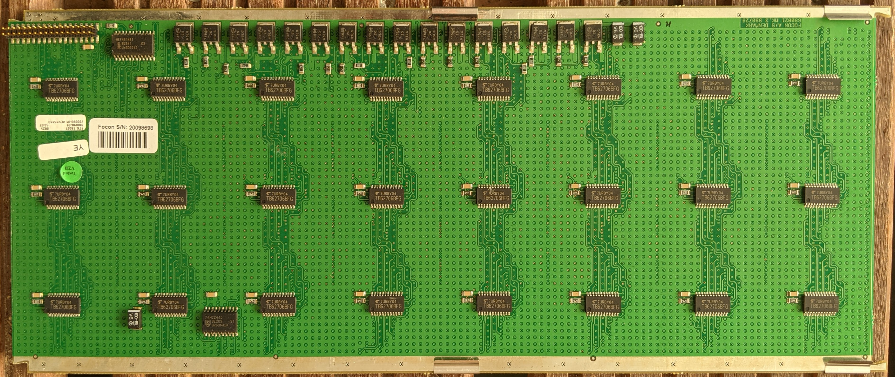

128x48 pixels, although only 128x32 are populated.
Row/Column with shift registers and row-decode to MOSFET.
Triple scan (three rows on at a time), although the bottom third
of the display is not populated so really only dual scan.
All of the shift registers are connected in a single chain
and interleaved between rows, so image must be clocked in together.

## Components

* 24x [TB62706](datasheets/TB62706.pdf) - 16-bit shift register (
* 16x [NTD20NO3L27](datasheets/NTD20N03L27-D.PDF) - N-Channel MOSFET (low-side row switch)
* 1x [74HCT244](datasheets/74HC_HCT244.pdf) - Octal buffer (clock fanout)
* 1x [HEF4514BT](datasheets/HEF4514BT.pdf) - 4-to-16 line decoder (row select)

## Pinout

| Function | Pin | Pin | Function  |
| -------: | :-: | :-: | :-------- |
| G0       |  1  |  2  | Data in   |
| G0       |  3  |  4  | Data out  |
| G0       |  5  |  6  | VDD (Mux) |
| G0       |  7  |  8  | VDD (Mux) |
| G0       |  9  | 10  | VDD (Mux) |
| G0       | 11  | 12  | Latch (SR)|
| G0       | 13  | 14  | Clock (SR)|
| G0       | 15  | 16  | !E (Mux)  |
| GND      | 17  | 18  | A3 (Mux)  |
| GND      | 19  | 20  | A2 (Mux)  |
| GND      | 21  | 22  | A1 (Mux)  |
| GND      | 23  | 24  | A0 (Mux)  |
| GND      | 25  | 26  | NC?       |
| GND      | 27  | 28  | GND       |
| GND      | 29  | 30  | GND       |
| GND      | 31  | 32  | VDD (LED) |
| GND      | 33  | 34  | VDD (LED) |

* Mux EL is tied high, so address is immediately used by decoder
* Mux !E is pulled high via a resistor, so it must be driven low to turn on
* Shift register !EN is tied low, so always active
* Shift register Latch and Clock are routed to the quad line driver
* Line driver output enables are tied low, so always active
* LED power only has two pins, seems to run at 5V
* Mux powr has three pins, also seems to run at 5V
* LED and Mux power appear to be on separate rails and not tied together
* `G0` doesn't directly connect to `GND` on the LED board, although it is tied to ground on the driver board.
* Exterior rails are grounded


## Shift registers

Layout is interleaved between the three scans:

```
0   3   6   9  12  15  18  21
1   4   7  10  13  16  19  22
2   5   8  11  14  17  20  23
```

The output from shift register 23 goes back to the ribbon
cable pin 4, if daisy chaining displays is desired.

* VDD is 0 - 7V, with 5V recommended
* Data is rising edge clocked.
* Latch does not require a clock; output appears after falling
edge of latch.
* R-Ext is 560 Ohm, roughly 35 mA constant current drive.
* 256 LEDs * 35 mA / LED == 9A at full brightness
* Two daisy-chained displays == 18A @ 5V == 90W
* Datasheet limits surface mount chip to less than 1W on PCB without heat sinks, so sustained full bright is not recommended.
