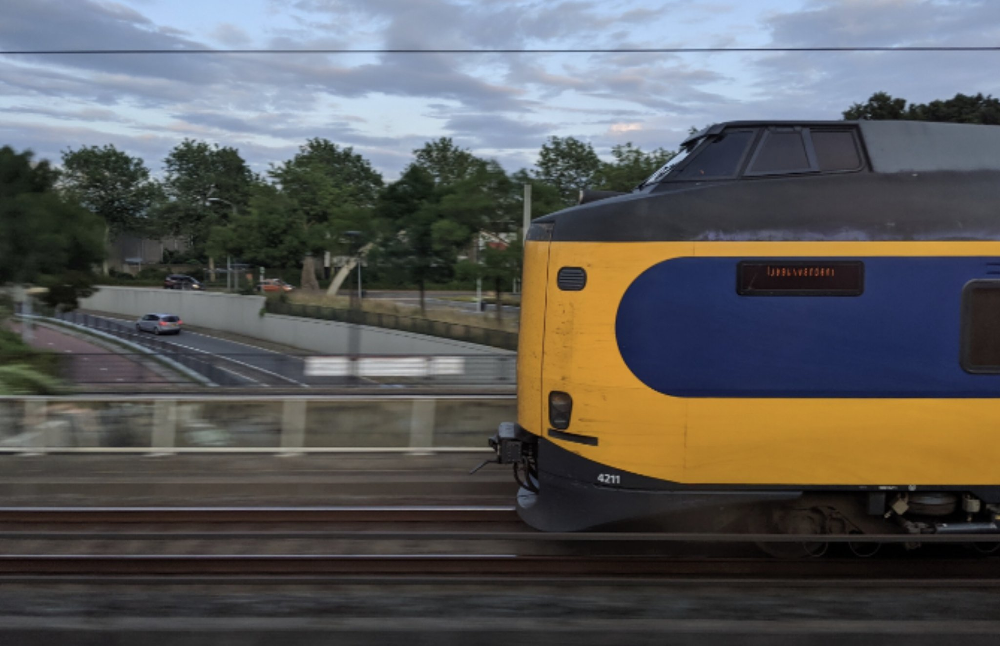
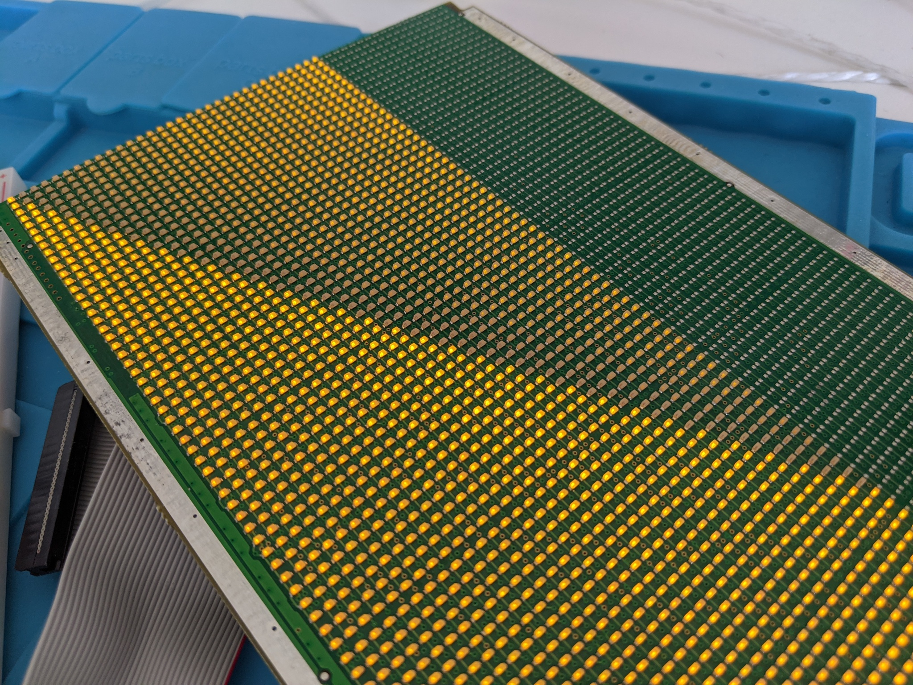
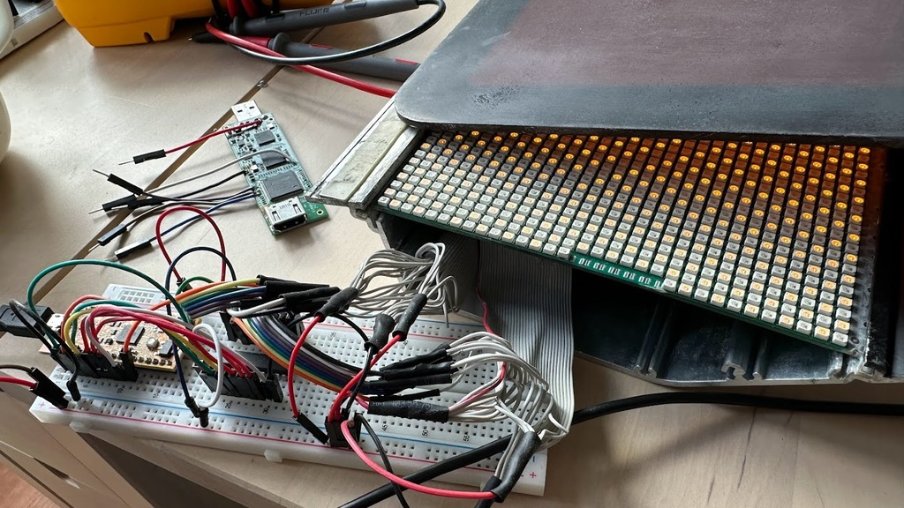
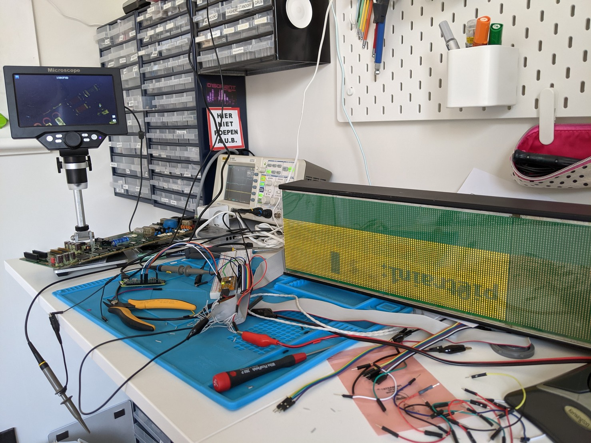

## NS Train Displays


The [Nederlandse Spoorwegen (NS)](https://en.wikipedia.org/wiki/Nederlandse_Spoorwegen)
auctioned parts of their older trains and some folks at [RevSpace in Den Haag](https://revspace.nl/Main_Page)
organized a [group buy of the LED display modules](https://revspace.nl/Treinonderdelen).
The original control computers need an odd voltage and listen for multi-drop RS485 with
no published protocol, so this is a way to replace it with an iCE40 FPGA and optionally
a Raspberry Pi.

## Components


The indoor modules are 128x48 pixels, although only 128x32 are populated.
Row/Column with shift registers and row-decode to MOSFET.
Eight columns of all 32 pixels are on at a time; the layout is very weird.
All of the shift registers are connected in a single chain
and interleaved between rows, so image must be clocked out to match.

* 24x [TB62706](datasheets/TB62706.pdf) - 16-bit shift register (
* 16x [NTD20NO3L27](datasheets/NTD20N03L27-D.PDF) - N-Channel MOSFET (high-side row switch)
* 1x [74HCT244](datasheets/74HC_HCT244.pdf) - Octal buffer (clock fanout)
* 1x [HEF4514BT](datasheets/HEF4514BT.pdf) - 4-to-16 line decoder (row select)

## Pinout

| Function | Pin | Pin | Function  |
| -------: | :-: | :-: | :-------- |
| VDD (LED)|  1  |  2  | Data in   |
| VDD (LED)|  3  |  4  | Data out  |
| VDD (LED)|  5  |  6  | VDD (Mux) |
| VDD (LED)|  7  |  8  | VDD (Mux) |
| VDD (LED)|  9  | 10  | VDD (Mux) |
| VDD (LED)| 11  | 12  | Latch (SR)|
| VDD (LED)| 13  | 14  | Clock (SR)|
| VDD (LED)| 15  | 16  | !E (Mux)  |
| VDD (LED)| 17  | 18  | A3 (Mux)  |
| GND      | 19  | 20  | A2 (Mux)  |
| GND      | 21  | 22  | A1 (Mux)  |
| GND      | 23  | 24  | A0 (Mux)  |
| GND      | 25  | 26  | NC?       |
| GND      | 27  | 28  | GND       |
| GND      | 29  | 30  | GND       |
| GND      | 31  | 32  | VDD (SR)  |
| GND      | 33  | 34  | VDD (SR)  |

* Mux EL is tied high, so address is immediately used by decoder
* Mux !E is pulled high via a resistor, so it must be driven low to turn on
* Shift register !EN is tied low, so always active
* Shift register Latch and Clock are routed to the quad line driver
* Line driver output enables are tied low, so always active
* Shift Register power has two pins, seems to run at 5V
* Mux power has three pins, also seems to run at 5V
* Shift Register, LED and Mux power appear to be on separate rails and not tied together
* The LED VDD is tied to common drain on the mosfets
* Exterior rails are grounded


## Shift registers

Layout is interleaved between the three rows of shift registers, with the bottom row
driving unpopulated LEDs.  The actual output is in columns.  It is a bit confusing.

```
0   3   6   9  12  15  18  21
1   4   7  10  13  16  19  22
2   5   8  11  14  17  20  23
```

The output from shift register 23 goes back to the ribbon
cable pin 4, if daisy chaining displays is desired.

* VDD is 0 - 7V, with 5V recommended
* Running the LEDs at 6V makes them much brightner
* Data is rising edge clocked.
* Latch does not require a clock; output appears after falling edge of latch.
* R-Ext is 560 Ohm, roughly 35 mA constant current drive.
* 256 LEDs * 35 mA / LED == 9A at full brightness
* Two daisy-chained displays == 18A @ 5V == 90W
* Datasheet limits surface mount chip to less than 1W on PCB without heat sinks, so sustained full bright is not recommended.
* In practice they seem to draw around 2A with all LEDs on

## PWM



It is possible to dim the entire display by driving a PWM signal
on the `!EN` pin.
With a fast enough pixel clock and Binary-Coded-Modulation,
it is possible to have a decent gradient with only 8 constant
time scans of each row.

## HDMI interface



The ice40up5k is just barely fast enough to process the baseline 640x480@60 video
that HDMI requires devices to support.  This eliminates the need to do
the special Pi setup and also enables OpenGL support or the user of any other
device with HDMI output as a video source.

The signalling requires 8 pins for the four differential pairs (Clock, Blue, Red, Green)
and two pins for the i2c, leaving plenty of pins for outputs to drive the LED matrices.

HDMI uses CML differential pairs, so they require 50 Ohm pullup resistors and
a 100 Ohm across the input pins.  TODO: should they be AC coupled via 10nF caps?

The HDMI pixel clock is 1/10th of the bit rate and at an unknown phase
relative to the bits.  This requires a PLL on the clock and then also
necessitates a clock-crossing technique for moving the raw 8b10b encoded
data to pixel clock.  At 640x480@60, the pixel clock is 25 MHz, which is
no problem, and the bit clock is 250 MHz, which is at the upper limit of
the ice40up5k.  TODO: can this use DDR at 5x to reduce the speed required?

The HDMI clock pin *must* connect to the global buffer input, GPIO 37 and its pair.
This allows it to feed into the global fanout clock, and also feed into the PLL.

The HDMI data pins can use any of the differential pairs, ideally next to the clock inputs
and with matched lengths.

TODO: implement EDID interface so that the Pi doesn't need to be hacked to force 640x480.


## Pi setup


* https://learn.watterott.com/hats/rpi-display/fbtft-install/
* Activate console on display, no fbcp, no calibrator, no tslib

SPI0 port pins on the PI:
* 18 == GPIO24 = Data/Command
* 19 == GPIO10 = Data out
* 20 == GND
* 21 == GPIO09 = Data in (unused)
* 23 == GPIO11 = SCLK
* 24 == GPIO8  = CE0
* 25 == GND

On the FPGA:
```
	wire spi_tft_cs = gpio_45;
	wire spi_tft_dc = gpio_47;
	wire spi_tft_di = gpio_46;
	wire spi_tft_clk = gpio_2;
```
